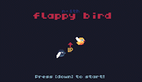

# n+1th flappy bird

This is my first game for the TIC-80 fantasy computer. 

Not so good, not so original, but I learned a lot with it. It is just a simple flappy bird clone.

You can download and open the .tic file in your TIC80 or just open the index.html from the html_build folder and play the game!

TIC-80 fantasy computer:
https://tic80.com/

